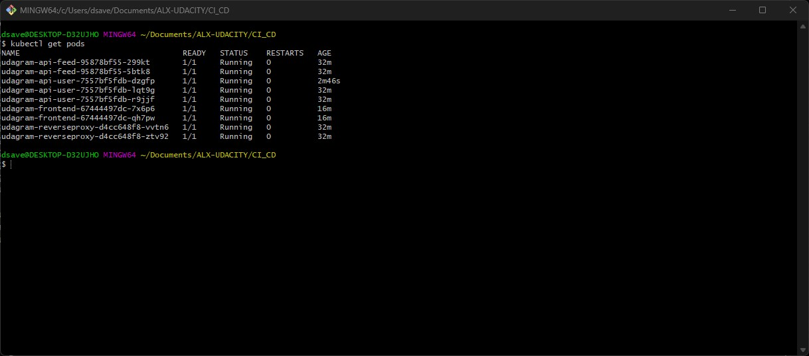

# Udagram Monolith to Microservices Application Submission

## My Front end `Deployment.yaml` file
Kubernetes services are replicated. At least one of the Kubernetes services has replicas: defined with a value greater than 1 in its deployment.yml file. bellow is a sample of my `deployment configuration`
 ```yaml
apiVersion: apps/v1
kind: Deployment
metadata:
  name: udagram-frontend
  labels:
    app: udagram-frontend
spec:
  replicas: 2
  selector:
    matchLabels:
      app: udagram-frontend
  template:
    metadata:
      labels:
        app: udagram-frontend
    spec:
      containers:
      - name: udagram-frontend
        image: dsaved/udagram-frontend:v2
        imagePullPolicy: Always
        ports:
        - containerPort: 80
 ```

## Deployment Pipeline
* DockerHub showing containers that you have pushed

* GitHub repository’s settings showing your Travis webhook (can be found in Settings - Webhook)

The travis ci does not use webhook configuration to pull repositories
it uses application integration


* Travis CI showing a successful build and deploy job


## Kubernetes
* To verify Kubernetes pods are deployed properly
```bash
kubectl get pods
```

* To verify Kubernetes services are properly set up
```bash
kubectl describe services
```


* To verify that you have horizontal scaling set against CPU usage
```bash
kubectl describe hpa
```

* To verify that you have set up logging with a backend application
```bash
kubectl logs {pod_name}
```


## Additional
```bash
kubectl get svc
```

